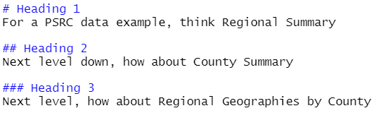
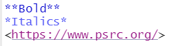

Welcome to my Happy Little World. It is great to see all my friends eager to learn how to create a masterpiece using our R Skills. Let's all learn together how to make our own HTML R Markdown document.

Markdown is not unique to R, it is actually a lightweight markup language for creating formatted text using a plain-text editor. John Gruber and Aaron Swartz created Markdown in 2004 as a markup language that is appealing to human readers in its source code form. Markdown is widely used in blogging, instant messaging, online forums, collaborative software, documentation pages, and readme files.

A R Markdown document is made up of three key parts:  

1. Header  
2. Chunks  
3. In-line Text  

# Headers
Lets's Start with the **Header** of our HTML document - it tells R exactly what we want to do and how to do it. Here is the header we are going to use for our first markdown document:

{width=35%}

The key line in the header is **html_document**. This tells R what type of document to render. 

# Chunks
The next part of a markdown document are the Code **Chunks**. These are the places where we define the code that is run to tidy data, perform analysis and create outputs like charts and tables. Code **Chunks** are defined by ```. Let's use a code chunk to define any libraries our document will use and a reference to the location of an image file we want to display.

{width=100%}

There are many chunk options but the most used for me are **include** and **echo**. They are close in operation to one another with a subtle difference - **include=FALSE** will run your code chunk but no calculations or output are shown whereas **echo=FALSE** will run your chunk, not show the calculations in the chuink but will show any outputs.

When we run the chunk above, we should see this:

```{r setup, echo=TRUE}
library(knitr)
happy_accidents <- file.path(getwd() ,'bob-ross.jfif')
include_graphics(happy_accidents)
```

# In-Line Text
One of the biggest differences between R Markdown and the scripts you have written so far is that your scripts did analysis and created output but text descriptions were never included. Markdown can create a document full of text, images, graphics, maps. etc. that you can re-create. The power comes in the fact that the code is run on your data every time the document is rendered so if the data updates, so does your document! The text can be static but it can also be responsive to your code chunks.

## Basic Formatting
Syntax in your Markdown document is used to "encode" or build your page. 

### Headings
Let's start with **headings**. Headings are defined by the `#` sign and can range from Level 1 to Level 6, although I rarely go beyond Level 4 in my documents. Here is an example of how to define a few headings.

{width=100%}

Even though size and color changes with headings, never use headers for their looks - they define things including chapters in a table of contents. 

### Text Formats
The most useful formats I find to use on text include **bold**, *italics* and hyperlinks.

{width=50%}  


**Bold**  
*Italics*  
<https://www.psrc.org/>  

If you want a list of markdown syntax in R, use the cheatsheet that is accessible with `Help - Cheatsheets - R Markdown Cheatsheet`.

Let's wrap up our example with with some basic text to add to our webpage.

```{r echo=TRUE}

last.year <- "I hated 2020"
this.year <- "things will be better in 2021!"

```

`r last.year` but I know that **`r this.year`**

