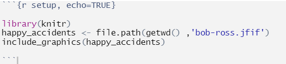

Welcome to my Happy Little World. It is great to see all my friends eager to learn how to create a masterpiece using our R Skills. Let's all learn together how to make our own HTML R Markdown document.

Markdown is not unique to R, it is actually a lightweight markup language for creating formatted text using a plain-text editor. John Gruber and Aaron Swartz created Markdown in 2004 as a markup language that is appealing to human readers in its source code form. Markdown is widely used in blogging, instant messaging, online forums, collaborative software, documentation pages, and readme files.

A R Markdown document is made up of three key parts:  

1. Header  
2. Chunks  
3. In-line Text  

# Headers
Lets's Start with the **Header** of our HTML document - it tells R exactly what we want to do and how to do it. Here is the header we are going to use for our first markdown document:

{width=35%}

The key line in the header is **html_document**. This tells R what type of document to render. 

# Chunks
The next part of a markdown document are the Code **Chunks**. These are the places where we define the code that is run to tidy data, perform analysis and create outputs like charts and tables. Code **Chunks** are defined by ```. Let's use a code chunk to define any libraries our document will use and a reference to the location of an image file we want to display.

{width=100%}

There are many chunk options but the most used for me are **include** and **echo**. They are close in operation to one another with a subtle difference - **include=FALSE** will run your code chunk but no calculations or output are shown whereas **echo=FALSE** will run your chunk, not show the calculations in the chuink but will show any outputs.

When we run the chunk above, we should see this:

```{r setup, echo=FALSE}
library(knitr)
happy_accidents <- file.path(getwd() ,'bob-ross.jfif')
include_graphics(happy_accidents)
```
