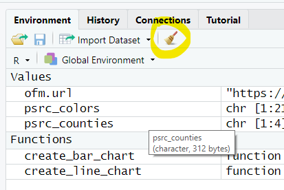
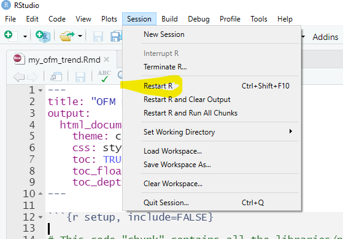
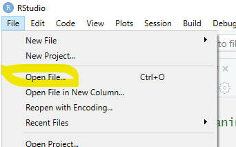
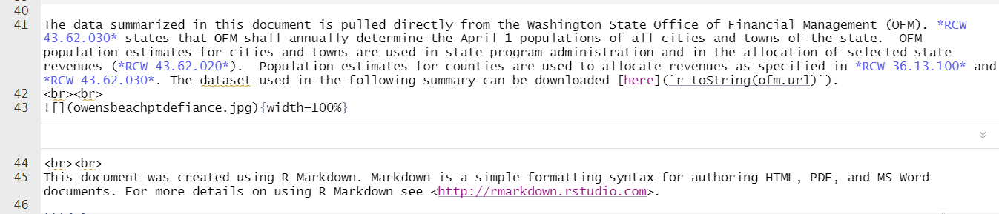

Welcome to our second R Markdown lesson. This lesson is going to create an html output file that summarizes population data from the Office of Financial Management (OFM). This lesson builds off of your previous lessons in `dplyr` and `ggplot2` so hope you remember all that great stuff! I am also going to show you a few tricks to make this look more *PSRC appropriate*.

# In the begining
To start this lesson, first let's clear out the environment and restart the R session. It is  a good idea to clear out the environment and restart R when you switch projects. If you don't, all your previous data will remain in memory as well as your libraries. It can lead to issues so it is best to start fresh - which also happens if you just close and reopen RStudio. To clear the environment and restart R do the following:

**Clear Environment**
{width=35%} 

**Restart R**
{width=35%}  

Now let's load the file `my_ofm_trend.Rmd` that you already downloaded into RStudio as our starting point. This `RMD` document should look somewhat familiar to the one we just did with Bob. It has a `yaml header`, a `code chunk`and some `inline text`. Lets take a look at the components quickly.

## YAML Header
The header tells R that we want an HTML document that uses some custom formatting provided in the file `styles.css`. We also want a table of contents that floats and only shows items down to Heading Level 2.

>`---`  
>title: "OFM Population Estimates"  
>output:  
>  html_document:  
>  theme: cerulean   
>  css: styles.css  
>  toc: TRUE  
>  toc_float: TRUE  
>  toc_depth: 2  
>`---`  

## Code Chunk for Initial Setup
This chunk of code loads all the libraries that we will be using in the lesson and provides some basic inputs that are used throughout the script. All the libraries we are using today were used in the previous two R sessions, the only new one for today is `knitr`.  

There are a couple new concepts that we will touch on today but not spend a lot of time looking at - how to download an Excel file directly from a website and also how to use other files that might contain functions, lists, inputs etc. in your code without having to re-type them.

```{r setup, eval=FALSE, echo=TRUE}

# This code "chunk" contains all the libraries/packages that are used in the overall script as well basic inputs that we might want to change

# Packages for Data Cleaning/Processing
library(tidyr)
library(dplyr)
library(stringr)
library(openxlsx)

# Packages for Table and Chart creation
library(ggplot2)
library(scales)
library(plotly)

# Packages used to create markdown document (needed to knit children)
library(knitr)

# Some basic variables that will be used by the script
psrc_counties <- c("King","Kitsap","Pierce","Snohomish")

ofm.url <- 'https://www.ofm.wa.gov/sites/default/files/public/dataresearch/pop/april1/ofm_april1_population_final.xlsx'

# Read in Functions and color palette
source(file.path(getwd() , 'functions.R'))
source(file.path(getwd() , 'psrc_palette.R'))

```

### New Content - sourcing files
When we `source`a file, we are effectively telling R to run that file and make all of its contents available in the current R session. In this example, we `source` two files:

1. functions.R
2. psrc_palette.R

#### Functions
The `functions.R` file has two custom functions that were written to create a line and bar chart using ggplot2. I write functions like this so that I can make my charts and figures look consistent without having to keep copying and pasting things. Remember the golden rule on functions - if you copy the same line more than twice, write a function instead! Let's open `funcitons.R` in RStudio so you can see what it looks like using:  
{width=35%}   

I have also placed the code here as well:

``` {r, eval=FALSE, echo=TRUE}

# Useful Functions

create_line_chart <- function(w.data, w.x, w.y, w.color, w.ltype, w.lwidth, w.palette) {
  
  y.max <- 1.25 * max(w.data[w.y])
  x.breaks <- unique(w.data %>% pull(w.x))
  
  g <-  ggplotly(ggplot(data=w.data, 
                        aes(x = get(eval(w.x)), 
                            y = get(eval(w.y)), 
                            color = get(eval(w.color)), 
                            group=1, 
                            text = paste0("<b>Year: </b>",  get(eval(w.x)), "<br>","<b>Population: </b>", prettyNum(round(get(eval(w.y)), 0), big.mark = ","), "<br>")))  + 
                   geom_line(linetype = w.ltype,
                             size = w.lwidth) +
                   scale_y_continuous(labels = label_comma(), limits = c(0,y.max)) +
                   scale_x_continuous(breaks= x.breaks) +
                   scale_color_manual(values = w.palette) +
                   labs(x = w.x, y = NULL) +
                   theme(plot.title = element_text(size = 10, face = 'bold'),
                         axis.text.x = element_text(angle = 0,
                                                    hjust = 1, 
                                                    vjust = 1,
                                                    family = 'Comic Sans MS'),
                         axis.ticks.x = element_blank(),
                         axis.line.x = element_blank(),
                         axis.line.y = element_line(colour="#BBBDC0",size = 0.25),
                         panel.background = element_blank(),
                         panel.grid.major.y = element_line(colour="#BBBDC0",size = 0.25),
                         panel.grid.minor.y = element_line(colour="#BBBDC0",size = 0.25),
                         panel.grid.major.x = element_blank(),
                         panel.grid.minor.x = element_blank(),
                         text = element_text(family = "Segoe UI"),
                         legend.position = "bottom",
                         legend.title = element_blank()),
                 tooltip = c("text")) %>% layout(legend = list(orientation = "h", xanchor = "center", x = 0.5, y = -0.25), hovermode = "x")
  
  return(g)
  
}

create_bar_chart <- function(w.data, w.x, w.y, w.color, w.bartype, w.transparent, w.palette) {
  
  x.breaks <- unique(w.data %>% pull(w.x))
  
  g <-  ggplotly(ggplot(data = w.data,
                        aes(x = get(eval(w.x)), 
                            y = get(eval(w.y)), 
                            fill = get(eval(w.color)), 
                            group=1, 
                            text = paste0("<b>", get(eval(w.color))," Population: </b>", prettyNum(round(get(eval(w.y)), 0), big.mark = ","), "<br>"))) +
                   geom_col(color = "black",
                            alpha = w.transparent,
                            position = w.bartype) +
                   scale_y_continuous(labels = label_comma()) +
                   scale_x_continuous(breaks= x.breaks) +
                   scale_fill_manual(values = w.palette) +
                   labs(x = w.x, y = NULL) +
                   theme(plot.title = element_text(size = 10, face = 'bold'),
                         axis.text.x = element_text(angle = 0,
                                                    hjust = 1, 
                                                    vjust = 1,
                                                    family = 'Comic Sans MS'),
                         axis.ticks.x = element_blank(),
                         axis.line = element_blank(),
                         panel.background = element_blank(),
                         panel.grid.major.y = element_line(colour="#BBBDC0",size = 0.25),
                         panel.grid.minor.y = element_line(colour="#BBBDC0",size = 0.25),
                         panel.grid.major.x = element_blank(),
                         panel.grid.minor.x = element_blank(),
                         text = element_text(family = "Segoe UI"),
                         legend.position = "bottom",
                         legend.title = element_blank()),
                 tooltip = c("text")) %>% layout(legend = list(orientation = "h", xanchor = "center", x = 0.5, y = -0.25))
  
  return(g)
  
}
```

#### Palette
`palette.R` has information on what colors to use for different specific names and categories. It is a named vector where if you pass it the name (the value on the left side of the equal sign) it returns the HEX color (the value on the right side of the equal sign). In this code, `Kitsap County` will always be colored with hex code `#F4835E`.

``` {r, echo=TRUE, eval=FALSE}
psrc_colors <- c(
  "King County" = "#AD5CAB",
  "Incorporated King County" = "#C388C2",
  "Unincorporated King County" = "#E3C9E3",
  "Kitsap County" = "#F4835E",
  "Incorporated Kitsap County" = "#F7A489",
  "Unincorporated Kitsap County" = "#FBD6C9",
  "Pierce County" = "#A9D46E",
  "Incorporated Pierce County" = "#C0E095",
  "Unincorporated Pierce County" = "#E2F1CF",
  "Snohomish County" = "#40BDB8",
  "Incorporated Snohomish County" = "#73CFCB",
  "Unincorporated Snohomish County" = "#BFE9E7",
  "Region Total" = "#91268F",
  "Incorporated Region Total" = "#AD5CAB",
  "Unincorporated Region Total" = "#E3C9E3",
  "State Total" = "#8CC63E",
  "Incorporated State Total" = "#A9D46E",
  "Unincorporated State Total" = "#E2F1CF"
)
```

## Inline Text
This is the first section of the document that renders text - a brief description of what the data is. It includes some text formatting, an inline image and a link to the data. No need to type this all out, it is already in the document and looks like this:  

{width=100%} 

# dplyr Fun
Now lets start processing the OFM data so that we can create the visuals we want in our document. The steps we are going to follow are:

1. Download the data.
2. Clean, format and reshape the data
3. Add regional data

## Download from a URL
Base R's function `download.file` can be used to copy a file from an url to a local copy on your computer. There are several parmeters you can use but the most common ones you need are:

* url (link to file to download)
* destfile (name of file to save to on your computer)
* quiet (TRUE turns off any warnings, progress bar, etc.)
* mode (use of 'wb' is most commmon on windows machines as it is a binary file type)

```{r ofm_data_prep, eval=FALSE, echo=TRUE}

download.file(url = ofm.url, destfile = "working.xlsx", quiet = FALSE, mode = "wb")
ofm.pop.file <- paste0(getwd(),"/working.xlsx")
ofm.pop <- as_tibble(read.xlsx(ofm.pop.file, detectDates = TRUE, skipEmptyRows = TRUE, startRow = 5, colNames = TRUE))

```

Let's take a look at `ofm.pop` in your environment. Looks like a wide format table with extra lines and other things that are not useful for plotting in `ggplot2`. Let's use `dplyr` to clean things up.

## Cleanup with dplyr
First let's trim it down to only include places in our region or for the state as a whole. This is done using `filter` in `dplyr`. We will only keep rows where the value in `County` is in our list of counties for the region along with the State.
```{r eval=FALSE, echo=TRUE}

ofm.pop <- ofm.pop %>%
  filter(County %in%  c(psrc_counties,"State"))

```

Now let's make it long form by transforming any `column` with the word `Population` in it and keeping the rest. We do this using `pivot_longer`.
```{r eval=FALSE, echo=TRUE}

ofm.pop <- ofm.pop %>%
  pivot_longer(cols=contains("Population"), names_to="Year", values_to="Estimate")

```

The column `Line` is only useful to OFM and used in Excel, let's get rid of it using an `inverse` of `select`. You get everything but a specific column by using `-` before the column name.
```{r eval=FALSE, echo=TRUE}

ofm.pop <- ofm.pop %>%
  select(-Line) 

```

Getting closer! The `Year` column from OFM is really long and we only want the integer that represents the actual year year so we can use it for plotting and summarizing. This is where `stringr` is great - it makes pattern recognition and string replacement a snap! At the same time, let's use it to get rid of the word `(part)` in the Jurisdicition label - we want Bothell to be Bothell since we have the county identifier already.
    
```{r eval=FALSE, echo=TRUE}

ofm.pop <- ofm.pop %>%
  mutate(Year = str_replace(Year, ".Population.*", ""), Jurisdiction = str_replace(Jurisdiction, " \\(part\\)", ""))

```

So close. When we read that file from OFM, things like the population came in as a `character` which is no good for doing analysis. We can use `mutate` to change the format of a column (or multiple columns) in `dplyr`. If you use multiple columns, be sure to use the `across` function.

```{r eval=FALSE, echo=TRUE}

ofm.pop <- ofm.pop %>%
  mutate(across(c('Filter','Year','Estimate'), as.numeric))

```

## Entire working dplyr chunk
Now that we stepped through all that, let's go ahead and copy and paste the following code to to our `dplyr` chunk so that we can move along. If you have questions about what the rest of the code is doing, come visit me during office hours and we can chat it over.
    
```{r eval=FALSE, echo=TRUE}

# This code chunk will download the OFM file from the web, put a temp copy on your hard drive, clean it up for analysis and then remove the temporary file afterwards.

download.file(ofm.url, "working.xlsx", quiet = FALSE, mode = "wb")
ofm.pop.file <- paste0(getwd(),"/working.xlsx")

ofm.pop <- as_tibble(read.xlsx(ofm.pop.file, detectDates = TRUE, skipEmptyRows = TRUE, startRow = 5, colNames = TRUE))

# Get rid of things we don't need, make it long form and clean it up for use in plot making
ofm.pop <- ofm.pop %>%
  filter(County %in%  c(psrc_counties,"State")) %>%
  pivot_longer(cols=contains("Population"), names_to="Year", values_to="Estimate") %>%
  select(-Line) %>%
  mutate(Year = str_replace(Year, ".Population.*", ""), Jurisdiction = str_replace(Jurisdiction, " \\(part\\)", "")) %>%
  mutate(across(c('Filter','Year','Estimate'), as.numeric))

# Create a Regional Summary by Filter Type and then Join to Full OFM tibble
region.pop <- ofm.pop %>%
  filter(Filter <= 3) %>%
  select(Filter,Year, Estimate) %>%
  group_by(Filter,Year) %>%
  summarize_all(sum) %>%
  mutate(County = "Region") %>%
  mutate(Jurisdiction = "Region Total") %>%
  mutate(Jurisdiction = ifelse(Filter == 2, "Unincorporated Region Total", Jurisdiction)) %>%
  mutate(Jurisdiction = ifelse(Filter == 3, "Incorporated Region Total", Jurisdiction))

# Add the regional results to the OFM full tibble
ofm.pop <- bind_rows(ofm.pop,region.pop)

# Add a column to place cities in population bins
ofm.pop <- ofm.pop %>%
  mutate(PopRange = case_when(
        Estimate < 5000 ~ 1,
        Estimate >= 5000 & Estimate <10000 ~ 2,
        Estimate >= 10000 & Estimate < 25000 ~ 3,
        Estimate >= 25000 & Estimate < 50000 ~ 4,
        Estimate >= 50000 & Estimate < 75000 ~ 5,
        Estimate >= 75000 ~ 6) %>%
  as.factor() %>%
    structure(levels = c("less than 5k","5k to 10k","10k to 25k","25k to 50k", "50k to 75k", "more than 75k"))
  )

# Remove the temporary Excel File that was downloaded and remove unnecessary data from memory
file.remove(ofm.pop.file)
rm(region.pop)

# Determine a few parameters in the data
first.year <- min(ofm.pop$Year)
last.year<- max(ofm.pop$Year)

```